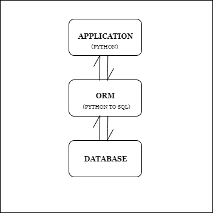

# Django ORM Mastery

## What is ORM?
Object–relational mapping in computer science is a programming technique for converting data between type systems using object-oriented programming languages. 
This creates, in effect, a "virtual object database" that can be used from within the programming language.

## Understand with a diagram
</img>

<b>In simple terms, to avoid creating, maintaing or updating the database manually, programming languages can use ORM technique to do all those tasks that can be done with a database.</b>

## MODEL

```
from django.db import models

class Person(models.Model):
    first_name = models.CharField(max_length=30)
    last_name = models.CharField(max_length=30)
```

The above Model is equivalent to the query below:

```
CREATE TABLE myapp_person (
    "id" bigint NOT NULL PRIMARY KEY GENERATED BY DEFAULT AS IDENTITY,
    "first_name" varchar(30) NOT NULL,
    "last_name" varchar(30) NOT NULL
);
```

<i>Note: An id field is added automatically, but this behavior can be overridden.</i>


### Some useful <b>Model field Names</b>

1. `AutoField` : It is an IntegerField that automatically increments.
2. `BooleanField` : A true/false field. The default form widget for this field is a CheckboxInput.
3. `CharField` : A field to store text-based values.
4. `DateField` : A date, represented in Python by a datetime.date instance
5. `DateTimeField` : It is used for date and time, represented in Python by a datetime.datetime instance.
6. `DecimalField` : It is a fixed-precision decimal number, represented in Python by a Decimal instance.
7. `EmailField` : It is a CharField that checks that the value is a valid email address.
8. `FileField` : It is a file-upload field.
9. `FloatField` : It is a floating-point number represented in Python by a float instance.
10. `IntegerField` : It is an integer field. Values from -2147483648 to 2147483647 are safe in all databases supported by Django.
11. `SlugField` : Slug is a newspaper term. A slug is a short label for something, containing only letters, numbers, underscores or hyphens. They’re generally used in URLs.
12. `TextField` : A large text field. The default form widget for this field is a Textarea.
13. `TimeField` : A time, represented in Python by a datetime.time instance.
14. `URLField` : A CharField for a URL, validated by URLValidator.
15. `UUIDField` : A field for storing universally unique identifiers. Uses Python’s UUID class. When used on PostgreSQL, this stores in a uuid datatype, otherwise in a char(32).


### Some useful <b>Relationship Fields</b>

1. `ForeignKey` : A many-to-one relationship. Requires two positional arguments: the class to which the model is related and the on_delete option. (Also know as, many-to-one relationship)

```
class Customer(models.Model):
    name = models.CharField(max_length=30)
    def __str__(self):
        return self.name
        
class Order(models.Model):
    customer = models.ForeignKey(Customer, on_delete=models.CASCADE)
    order_details = models.TextField()
```
(One Customer can have mutiple orders, and if Customer is deleted, all its related orders get deleted.)

2. `ManyToManyField	` : A many-to-many relationship. Requires a positional argument: the class to which the model is related, which works exactly the same as it does for ForeignKey, including recursive and lazy relationships.

```
class Pizza(models.Model):
    name = models.CharField(max_length=30)
    toppings = models.ManyToManyField('Topping')

class Topping(models.Model):
    name = models.CharField(max_length=30)
```
(A pizza can have more than one topping, and a topping can go on more than one pizza, this is a great place to use a ManyToManyField.)

3. `OneToOneField` : A one-to-one relationship. Conceptually, this is similar to a ForeignKey with unique=True, but the “reverse” side of the relation will directly return a single object.

```
class Person(models.Model):
        name = models.CharField(max_length=30)
        def __str__(self):
            return self.name
            
    class Citizenship(models.Model):
        person = models.OneToOneKey(Person, on_delete=models.CASCADE)
        country = models.CharField(max_length=30)
```
(One Person can only have one citizenship)


### Some useful <b>Field options</b>
1. `null`: If True, Django will store empty values as NULL in the database. Default is False.
2. `blank`: If True, the field is allowed to be blank. Default is False. (null is purely database-related, whereas blank is validation-related. If a field has blank=True, form validation will allow entry of an empty value. If a field has blank=False, the field will be required.)
3. `choices`: A sequence of 2-tuples to use as choices for this field. The first element in each tuple is the value that will be stored in the database. The second element is displayed by the field’s form widget.
4. `default`: The default value for the field.
5. `help_text`: Extra “help” text to be displayed with the form widget. It’s useful for documentation even if your field isn’t used on a form.
6. `primary_key`: If True, this field is the primary key for the model.
7. `unique`: If True, this field must be unique throughout the table.
8. `verbose_name`: Optional first positional argument – a verbose name. 
